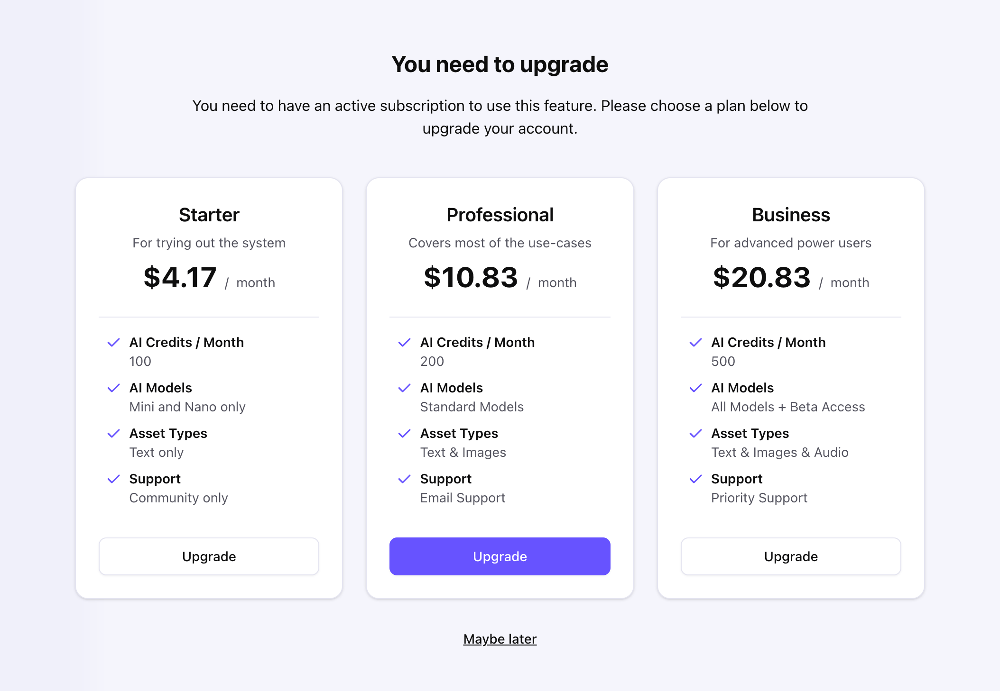

# Freemius JavaScript

Type-safe Freemius integration toolkit: a production-focused TypeScript/JavaScript SDK plus a React / Next.js Starter
Kit for implementing subscriptions, one‑off purchases, license & entitlement validation, and a secure self-service
customer portal.

<a href="https://freemius.com/help/documentation/saas-sdk/js-sdk/">
<picture>
  <source media="(prefers-color-scheme: light)" srcset="https://freemius.com/help/img/freemius-logo.svg">
  <source media="(prefers-color-scheme: dark)" srcset="https://freemius.com/help/img/freemius-logo-dark.svg">
  
</picture>
</a>

---

---

Looking for a step‑by‑step walkthrough of backend checkout generation, secure purchase validation, local entitlement
storage, webhook‑driven license lifecycle syncing, and feature gating logic? Check out the guides below.

- [Next.js / React Starter Kit](https://freemius.com/help/documentation/saas-sdk/framework/nextjs/) Integration.
- [Framework Agnostic](https://freemius.com/help/documentation/saas-sdk/js-sdk/integration/) Integration.

We also have the [React Starter Kit](https://freemius.com/help/documentation/saas-sdk/react-starter/) you can use on
your front-end to quickly render Checkout overlays, pricing tables, and a customer portal.

## Support / Questions

- Core SDK Docs: https://freemius.com/help/documentation/saas-sdk/js-sdk/
- Next.js Integration: https://freemius.com/help/documentation/saas-sdk/framework/nextjs/
- General Integration Flow: https://freemius.com/help/documentation/saas-sdk/js-sdk/integration/
- React Starter Kit: https://freemius.com/help/documentation/saas-sdk/react-starter/
- Issues / Bug Reports: https://github.com/Freemius/freemius-js/issues

Please open an issue for reproducible defects or clearly scoped feature gaps that align with the minimal,
execution‑oriented philosophy of this repository.

## Features & Packages

### [`@freemius/sdk`](./packages/sdk/README.md) (Server / Edge Runtimes)

Focused, framework‑agnostic primitives for securely interacting with the Freemius platform:

- [Typed API Client](https://freemius.com/help/documentation/saas-sdk/js-sdk/api/): Fine-tuned OpenAPI-derived API
  classes to easily interact with the [Freemius REST API](https://freemius.com/help/documentation/api/).
- [Checkout Utilities](https://freemius.com/help/documentation/saas-sdk/js-sdk/checkout/): Create Checkout URLs or
  Options for the Overlay mode, sandbox mode, redirect result parsing etc.
- [Webhook Processing](https://freemius.com/help/documentation/saas-sdk/js-sdk/webhooks/): HMAC‑SHA256 signature
  verification + event listener abstraction
- [Purchases & Entitlements](https://freemius.com/help/documentation/saas-sdk/js-sdk/purchases/): License retrieval,
  entitlement state validation, minimal model helpers

See the [full documentation](https://freemius.com/help/documentation/saas-sdk/js-sdk/) for all exported capabilities.

### [React Starter Kit](./packages/saas-kit/README.md) (Next.js / React)

An opinionated, production‑ready reference implementation showing how to operationalize the SDK inside a modern React /
Next.js stack. Built with shadcn/ui + Tailwind CSS.

Included building blocks:

- [Checkout](https://freemius.com/help/documentation/saas-sdk/react-starter/components/#checkout-components):
  `CheckoutProvider` + context wiring for invoking
  [overlay checkout](http://freemius.com/help/documentation/checkout/freemius-checkout-buy-button/) from any component
- [Pricing / Paywall](https://freemius.com/help/documentation/saas-sdk/react-starter/components/#paywall): `Subscribe` &
  `Topup` components for plan display, subscription initiation, and credit top‑ups
- [Customer Portal](https://freemius.com/help/documentation/saas-sdk/react-starter/components/#customer-portal-component):
  Authenticated portal UI for subscription, billing method, and invoice management

See the [Starter Kit docs](https://freemius.com/help/documentation/saas-sdk/react-starter/) for component APIs and
integration notes.

## Security Notes

Hard requirements for a correct integration:

- Secrets: Never expose `API_KEY`, `SECRET_KEY`, or signing material to the browser or untrusted execution contexts.
- Webhooks: Always verify the HMAC‑SHA256 signature using the raw, unparsed request body before mutating state.

## Contributing

1. Fork & clone
2. `npm install`
3. Create a feature branch (e.g. `feat/<concise-scope>`)
4. Implement change; run local builds / lint; add or update a changeset (`npx changeset`) if publishing a package change
5. Commit with a precise, imperative message
6. Open a PR referencing any related issue(s)

Read [Contribution Principles](./CONTRIBUTING.md) for more details.

## License

MIT © Freemius Inc

---

Payments, tax handling, subscription lifecycle management, and licensing are abstracted so you can focus on product
functionality rather than billing infrastructure.

https://freemius.com
